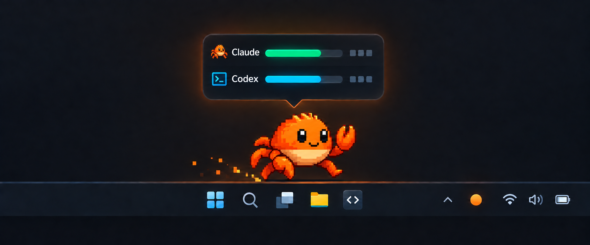
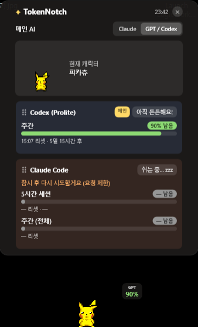
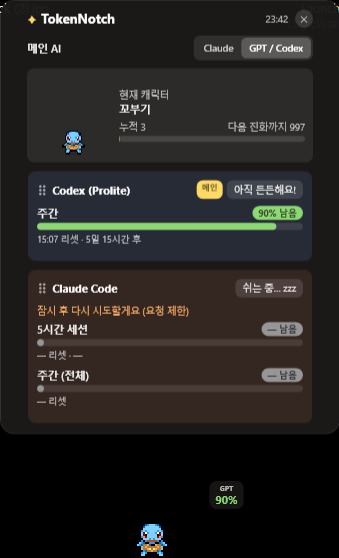
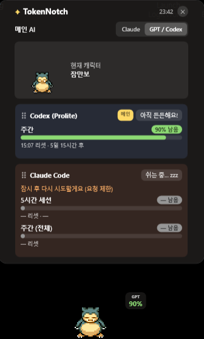

# TokenNotch for Windows

<p align="center">
  
</p>

<p align="center">
  <strong>Claude Code와 Codex의 남은 사용량을, 작업표시줄 위의 작은 펫으로 확인하세요.</strong>
</p>

<p align="center">
  Windows 10/11 · .NET 9 · MIT License
</p>

macOS용 [TokenNotch](https://github.com/Keonho-Chu/TokenNotch)를 Windows 작업표시줄에 맞게
옮긴 위젯입니다. 선택한 AI의 남은 할당량에 따라 펫의 표정과 움직임이 달라지고,
마우스를 올리면 Claude Code와 Codex의 사용량·리셋 시간이 함께 펼쳐집니다.

> 대표 이미지는 제품 콘셉트 일러스트입니다. 실제 앱 화면은 아래에서 확인할 수 있습니다.

## 실제 화면

<p align="center">
  
  
  
</p>

> 화면 예시는 개인 로컬 픽셀 팩을 적용한 모습입니다. 해당 캐릭터 원본과 애니메이션 팩은
> 저장소 및 배포 파일에 포함되지 않으며, 공개 빌드는 내장된 Clawd를 사용합니다.

## 주요 기능

- **Claude + Codex 한 화면** — 남은 사용량, 리셋 시각, 카운트다운을 서비스별 카드로 표시
- **작업표시줄 펫** — 화면 아래를 순찰하고, 드래그로 옮기거나 원하는 위치에 고정
- **사용량 반응** — 여유·주의·위기·오류 상태에 따라 표정과 애니메이션이 변화
- **메인 AI 선택** — 항상 보이는 퍼센트 배지와 펫의 상태를 Claude 또는 Codex에 연결
- **패널 맞춤 설정** — 카드 손잡이를 드래그해 Claude/Codex 순서를 변경
- **선택형 로컬 픽셀 팩** — 로컬 자산이 있을 때 캐릭터 선택과 누적 사용량 기반 진화를 지원
- **트레이 제어** — 숨기기·다시 보이기·위치 고정·종료, 중복 실행 자동 방지
- **설정 자동 저장** — 캐릭터, 메인 AI, 카드 순서와 고정 위치를 재시작 후에도 유지

## 요구 사항

| 항목 | 조건 |
|---|---|
| OS | Windows 10/11 x64 |
| 빌드 도구 | [.NET 9 SDK](https://dotnet.microsoft.com/download/dotnet/9.0) |
| 사용량 데이터 | 로그인된 Claude Code 또는 Codex CLI 계정(둘 다 사용 가능) |

## 빠른 시작

```powershell
git clone https://github.com/Hlxecz/TokenNotch_Window_V1.git
cd TokenNotch_Window_V1
dotnet run -c Release
```

앱이 시작되면 펫이 작업표시줄 위에 나타납니다. 처음 실행할 때 즉시 사용량을 가져오고,
이후 5분마다 새로고침합니다.

### 단일 실행 파일 만들기

```powershell
dotnet publish -c Release -r win-x64 --self-contained true `
  -p:PublishSingleFile=true `
  -p:IncludeNativeLibrariesForSelfExtract=true `
  -p:EnableCompressionInSingleFile=true `
  -o dist
```

빌드가 끝나면 `dist\TokenNotchWin.exe`를 실행하세요. `--self-contained true`로 만든 파일은
실행할 PC에 .NET 런타임이 따로 없어도 됩니다.

## 사용 방법

| 동작 | 결과 |
|---|---|
| 펫에 마우스 올리기 | Claude와 Codex 사용량 패널 열기 |
| 펫 왼쪽 드래그 | 작업표시줄 위 위치 이동 |
| 펫 오른쪽 클릭 | 캐릭터·진화 단계·메인 AI 선택, 위치 고정, 숨기기, 종료 |
| 패널의 카드 손잡이 드래그 | Claude와 Codex 카드 순서 변경 |
| 트레이 아이콘 더블 클릭 | 숨겨진 펫 다시 표시 |
| 트레이 아이콘 오른쪽 클릭 | 보이기·숨기기, 위치 고정, 종료 |

설정은 `%APPDATA%\TokenNotch\settings.json`에 저장됩니다.

## 로컬 픽셀 팩

공개 저장소에는 `Resources/app.ico`만 포함됩니다. 로컬 픽셀 팩이 없거나 형식이 맞지 않으면
앱은 자동으로 내장 Clawd를 표시합니다.

```text
Resources/
  pixel-*-actions/
    <character>/
      atlas.png
      manifest.json
```

로컬 자산을 제외한 공개용 실행 파일은 다음처럼 만듭니다.

```powershell
dotnet publish -c Release -r win-x64 --self-contained true `
  -p:PublishSingleFile=true `
  -p:IncludeLocalPetAssets=false `
  -o dist
```

진화를 지원하는 로컬 캐릭터는 사용률 1%당 10포인트가 쌓이며, 누적 100포인트와
300포인트에서 다음 단계가 해금됩니다. 해금된 이전 단계는 오른쪽 클릭 메뉴에서 다시
선택할 수 있습니다. 이 값은 실제 청구량이 아니라 캐릭터 성장을 위한 장식용 진행도입니다.

## 데이터와 보안

TokenNotch는 별도 로그인을 만들지 않고 각 CLI가 로컬에 저장한 자격증명을 사용합니다.

| 서비스 | 읽는 파일 | 요청 대상 |
|---|---|---|
| Claude Code | `%USERPROFILE%\.claude\.credentials.json` | `api.anthropic.com` |
| Codex CLI | `%USERPROFILE%\.codex\auth.json` | `chatgpt.com` |

- 앱은 자격증명 파일을 직접 수정하거나 제3자 서버로 보내지 않습니다.
- Claude 토큰이 만료되면 설치된 Claude CLI의 공식 갱신 경로를 한 번 실행해 복구를 시도합니다.
- Codex 자격증명은 읽기 전용으로 사용하며, 만료된 경우 `codex`를 한 번 실행해 갱신하면 됩니다.
- 사용량 API 요청은 5분 간격으로 실행됩니다.

## 문제 해결

| 증상 | 확인할 내용 |
|---|---|
| Claude 또는 Codex 카드에 로그인 오류가 표시됨 | 해당 CLI에서 로그인한 뒤 앱을 다시 실행하세요. |
| 퍼센트가 `—`로 표시됨 | 첫 조회가 끝나지 않았거나 요금제가 해당 사용량 창을 제공하지 않을 수 있습니다. |
| 펫을 숨긴 뒤 찾을 수 없음 | 시스템 트레이의 TokenNotch 아이콘을 더블 클릭하세요. |
| 로컬 캐릭터가 나타나지 않음 | `atlas.png`와 `manifest.json` 경로를 확인하세요. 형식이 맞지 않으면 Clawd로 대체됩니다. |
| 실행 파일을 다시 열어도 창이 추가되지 않음 | 정상 동작입니다. 두 번째 실행은 기존 인스턴스를 다시 표시합니다. |

## 프로젝트 구성

```text
TokenNotch-Windows/
├─ Controls/              # Clawd·로컬 픽셀 펫 렌더링과 진화
├─ Services/              # 사용량 API, 자격증명, 설정과 상태 모델
├─ docs/                  # README 이미지
├─ MainWindow.xaml        # 확장 패널과 펫 UI
├─ MainWindow.xaml.cs     # 이동·호버·애니메이션·카드 정렬
├─ App.xaml.cs            # 트레이와 단일 인스턴스 처리
└─ TokenNotchWin.csproj   # WPF/.NET 9 프로젝트 설정
```

## 라이선스 및 자산

소스 코드는 [MIT License](LICENSE)이며 원본 TokenNotch의 저작권 표시를 유지합니다.
로컬 캐릭터 자산과 화면 예시 속 캐릭터 그림에는 MIT 라이선스가 적용되지 않습니다.
